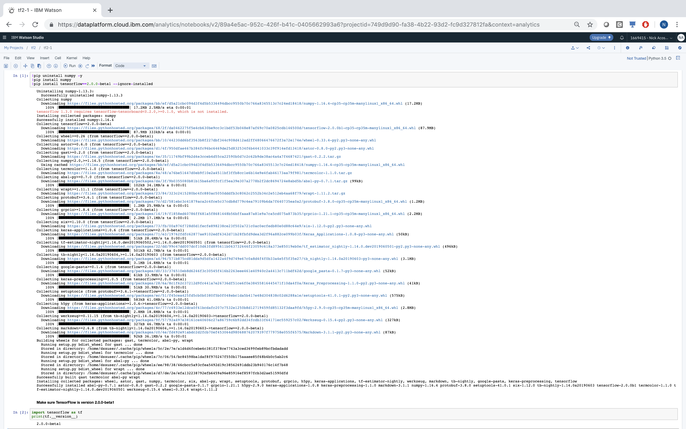

TensorFlow 2.0 just had its beta release a couple days ago. This major release focuses on community, simplicity, and ease of use, so I wanted to show the IBM Data Science Community how it can be used on IBM's Data Science Platform, Watson Studio.

First, we can see an example of a network built and trained in TensorFlow 1.X. Here we can see the presence of TensorFlow placeholders and TensorFlow sessions, hallmarks of TensorFlow 1.X models. These are used by TensorFlow in order to build a computational graph before it is executed so that a model can be be optimized in a faster programming language like C++ or CUDA and distributed across a cluster.

The following code is used to update TensorFlow in Watson Studio. You can download a notebook here to follow along. 

Next, TensorFlow's new upgrade utility allows for the automatic conversion of TensorFlow 1.X code into TensorFlow 2.0 code. It can be used on the previous network shown as follows.

The rest of the notebook shows how to build the same network in Keras, which as of TensorFlow 2.0 is the the high-level API for TensorFlow. The network can be trained using two different methods, both of which are shown.
